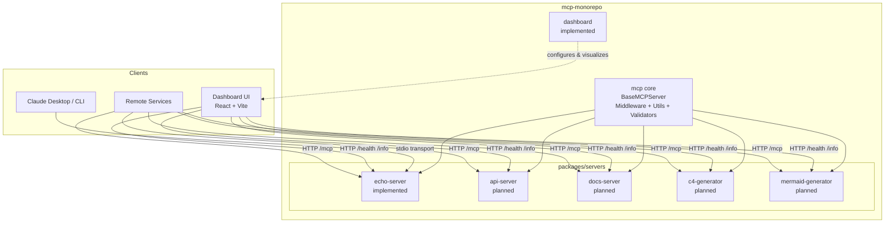

# MCP Monorepo Project Architecture

```mermaid
flowchart TB
  %% Clients
  subgraph Clients[Clients]
    CD[Claude Desktop / CLI]
    WB[Dashboard UI\nReact + Vite]
    RC[Remote Services]
  end

  %% Core and Server Layer
  subgraph Monorepo[mcp-monorepo]
    CORE[mcp core\nBaseMCPServer\nMiddleware + Utils + Validators]

    subgraph Servers[packages/servers]
      ECHO[echo-server\nimplemented]
      API[api-server\nplanned]
      DOCS[docs-server\nplanned]
      C4[c4-generator\nplanned]
      MERM[mermaid-generator\nplanned]
    end

    DASH[dashboard\nimplemented]
  end

  %% Shared framework relationship
  CORE --> ECHO
  CORE --> API
  CORE --> DOCS
  CORE --> C4
  CORE --> MERM

  %% Transport modes
  CD -->|stdio transport| ECHO

  WB -->|HTTP /health /info| ECHO
  WB -->|HTTP /health /info| API
  WB -->|HTTP /health /info| DOCS
  WB -->|HTTP /health /info| C4
  WB -->|HTTP /health /info| MERM

  RC -->|HTTP /mcp| ECHO
  RC -->|HTTP /mcp| API
  RC -->|HTTP /mcp| DOCS
  RC -->|HTTP /mcp| C4
  RC -->|HTTP /mcp| MERM

  DASH -.configures & visualizes.-> WB
```